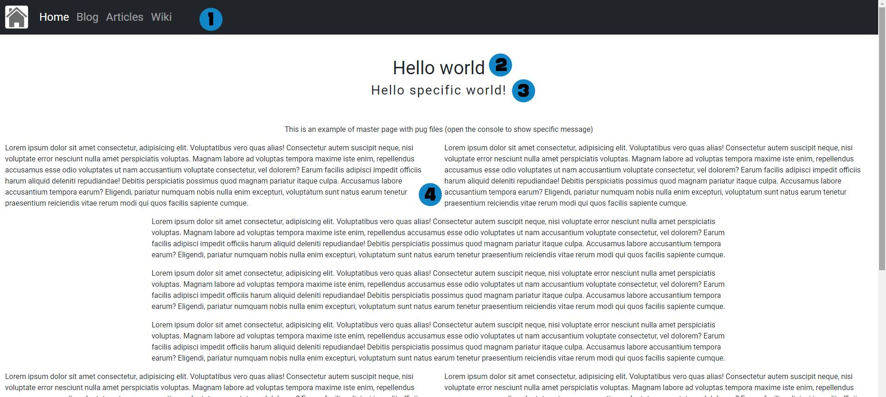
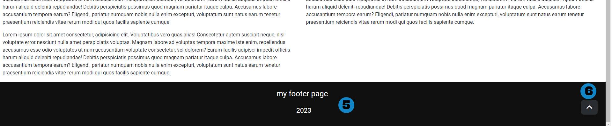

# Simple Master Page

### Requirements
1. Node JS
2. Pug cli (npm install pug-cli -g)

> Note: This project does not require any dependencies (no package.json will exist, the CLI is just for getting the results).

### The problem
1. I want to build a simple website (only CSS/HTML/Js).
2. I don't want to use JS frameworks (Vue, React, Angular, etc).
3. I want to change the menu or footer and have these changes reflected in all my html files.

### The solution
The [Master page](https://helpx.adobe.com/indesign/how-to/master-pages.html) concept refers to a layout that contains all general content of a web page eg: header (with menu), footer, general styles, general js, etc. All new pages can import them and use it, and only define the specific content for that file.

### Use:
This project structure can be used to render with [Pug cli](https://github.com/pugjs/pug-cli) all the [pug](https://pugjs.org/) files from the `pages` folder to the `public` folder.

### Example
The `pages/index.pug` defines the next code (you can add another .pug file in this folder with this structure and test):

```pug
extends ../pugs/master.pug

block styles
  +link('./css/specific.css')
  title Home
  +meta('description', `${new Date().getFullYear()} will be a great year`)

block content
    ...

block scripts
  +script('js/specific.js', true)

```
> Run command `pug -w -P .\pages\ -o .\public`

> Note: This project use JS modules (export/import syntax) so, you need to use a server to show the results. For dev and test you can use the Live Server VSCode extension.

You can change any html and the results will be renderer automatically.

### Details:
The first lines `import the master page` (header, footer, commong js, and common css).

Next, it is defined some specific content for the index page (specific css, the page title, and a meta description for this specific page)

The `content` block can contains any html for this page (The master page use bootstrap, so in this file can be used too).

Finally, the `scripts` block is usefull to import specific js only for this page.

### Results:


1. A common menu imported by the master page (from [/pugs/menu.pug](./pugs/menu.pug))
2. Html for this specific file.
3. This message has been set from the [/public/js/specific.js](./public/js/specific.js) file, this js only is imported in this page (is not part of the master page).
4. All content for this page.



5. General footer imported by the master page (from [/pugs/menu.pug](./pugs/footer.pug))
6. General back to top button imported by the master page (You can check the [/public/js/general.js](./public/js/general.js) for specific functionality details).

You can change the menu, footer, add another pug file into `pages` folder, etc. And execute `pug -w -P .\pages\ -o .\public`.

> The `public` folder is your final website :)

 For the pug syntax visit the [pug](https://pugjs.org/) docs.

> Greetings : )